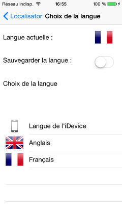
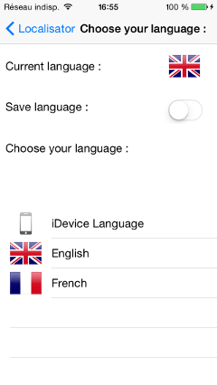

# README

Localisator is a small class you can use in order to change languages from within your iOS app, without having to restart it. It’s compatible with the localizable.strings file, so you don’t have to duplicate all your localized strings.

###**Licence:**

Localisator is under MIT Licence so you can use/modify it as you wish. Any feedback will be appreciated.
I do not own any of the images in the example project : they are used only as examples. If you own any of these images and have some issues about me using your images, let me know and I will change it quickly.

###**How to use it:**

Add the Localisator.h and Localisator.m in your project. Localisator uses ARC, si if your project doesn’t use ARC, don’t forget the « -fobjc-arc » flag in your build compile phase.

Replace the NSLocalizedString(key, comment) call by  [[Localisator sharedInstance] localizedStringForKey:key] in your code.

If you want your interface to change when the language is changed, all your graphical classes (UIViewController for ex) must subscribe to the kNotificationLanguageChanged notification which is fired when the language is changed

Any comments are welcomed 

@micazeve
micazeve@gmail.com

